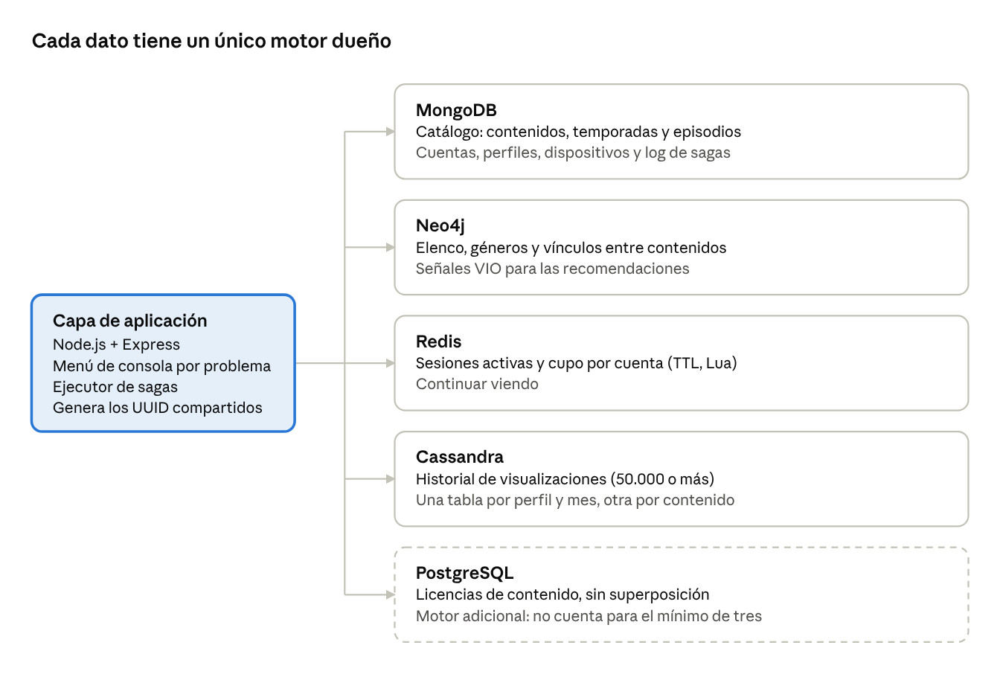

# StreamDB — Matriz de trazabilidad

7 de octubre de 2026 · Santiago Hanine

StreamDB reparte el dominio en cinco motores: cuatro NoSQL (MongoDB, Neo4j, Redis y Cassandra) y PostgreSQL como motor relacional adicional, solo para las licencias de contenido. Cada dato tiene un único motor dueño; si aparece en otro, es una copia deliberada con un responsable de sincronizarla.

## Criterios

- **Patrón de acceso:** cómo se lee y se escribe (por clave, recorrido de grafo, rango temporal, filtros combinados).
- **Volumen y frecuencia:** cuántos registros y cada cuánto se escriben.
- **Consistencia requerida:** fuerte (contratos, cupos de sesión) o eventual (señales para recomendaciones).
- **Identificador compartido:** todo objeto de negocio usa el mismo ID (UUID generado en la capa de aplicación) en todos los motores. Eso permite la trazabilidad del problema 8 y la idempotencia de las sagas.

## Arquitectura



La capa de aplicación es la única que habla con los motores y coordina las escrituras que cruzan más de uno. PostgreSQL aparece con borde punteado porque es el motor relacional opcional.

## Matriz entidad/proceso → motor

Los volúmenes son los que generará el script de carga; el historial es la entidad de mayor volumen que exige el enunciado (50.000 o más registros).

| Entidad / proceso | Cómo se lee | Cómo se escribe | Volumen | Frecuencia | Consistencia | Motor |
| --- | --- | --- | --- | --- | --- | --- |
| Cuenta + Perfiles | Por `idCuenta`, con sus perfiles embebidos | Alta de cuenta, edición de perfil | 1.000 cuentas, 2.500 perfiles | L media, E baja | Fuerte (email único) | **MongoDB** |
| Dispositivo | Por `idDispositivo` | Registro al primer uso | 3.000 | L media, E baja | Fuerte | **MongoDB** |
| Contenido + Temporadas + Episodios | Ficha completa por `idContenido`; filtros combinados por género, actor y plataforma (P7) | Alta por el administrador (P1), retiro (P8) | 500 contenidos, 5.000 episodios | L muy alta, E baja | Fuerte para `estado` | **MongoDB** |
| PlataformaOrigen, Genero | Embebidos en la ficha y como filtros | Carga inicial | 10 plataformas, 20 géneros | L alta, E muy baja | Fuerte | **MongoDB** |
| Actor + Actuacion | Elenco de un contenido; contenidos de un actor | P1 | 2.000 actores, 6.000 actuaciones | L alta, E baja | Fuerte | **Neo4j** |
| Vínculos entre contenidos (secuela, precuela, mismo universo, similar) | Recorridos de 1 a 3 saltos | P1 | 1.500 relaciones | L alta, E baja | Fuerte | **Neo4j** |
| Señal de consumo (`VIO`) | Recomendaciones del perfil (P5) | Al terminar un episodio o película (P4) | ~20.000 aristas | L media, E media | Eventual | **Neo4j** |
| Sesión activa + cupo por cuenta | Contar sesiones de una cuenta | Abrir (P2), expirar y cerrar (P6) | Cientos simultáneas | L y E muy altas | Fuerte y atómica | **Redis** |
| Continuar viendo | Un puntero por perfil y contenido | Cada pocos segundos (P3), avance de episodio (P4) | 10.000 punteros | E muy alta | Último valor gana | **Redis** (con AOF) |
| Historial de visualizaciones | Por perfil y período; por contenido (P8) | Solo inserción (P3, P4) | 50.000 o más | E muy alta, L media | Eventual | **Cassandra** |
| Licencia de contenido | Vigentes por contenido y región; vencidas a una fecha | Alta y renovación, pocas veces | 1.000 | L y E bajas | Fuerte, sin superposición | **PostgreSQL** |
| Log de sagas | Por `idSaga`; pendientes al reiniciar | Un cambio por paso | Uno por operación | E media | Fuerte (documento atómico) | **MongoDB** |

## Modelo relacional: Licencias (PostgreSQL)

La entidad nueva `Licencia` registra el permiso para mostrar un contenido en una región durante un período. Vive en PostgreSQL porque la base debe impedir que un contenido tenga dos licencias superpuestas en la misma región, y ningún motor NoSQL de la cursada lo garantiza sin código propio.

**Cambio en el DER:** se agrega `Licencia`, relacionada 1:N con `Contenido` (un contenido tiene muchas licencias) y 1:N con `PlataformaOrigen` (la plataforma la otorga). El retiro del problema 8 pasa a dispararse cuando vence una licencia.

```sql
CREATE EXTENSION IF NOT EXISTS btree_gist;

CREATE TABLE licencia (
  id_licencia   UUID PRIMARY KEY,
  id_contenido  UUID NOT NULL,          -- mismo ID que en Mongo, Neo4j y Cassandra
  id_plataforma UUID NOT NULL,
  region        CHAR(2) NOT NULL,       -- código de país ISO, ej. 'AR'
  vigencia      DATERANGE NOT NULL,     -- [desde, hasta)
  estado        TEXT NOT NULL DEFAULT 'vigente'
                CHECK (estado IN ('vigente', 'vencida', 'rescindida')),
  -- un contenido no puede tener dos licencias superpuestas en la misma región
  EXCLUDE USING gist (id_contenido WITH =, region WITH =, vigencia WITH &&)
    WHERE (estado <> 'rescindida')
);

CREATE INDEX licencia_vencimiento ON licencia (upper(vigencia)) WHERE estado = 'vigente';
```

`id_contenido` no tiene clave foránea porque el contenido vive en MongoDB; la capa de aplicación verifica que exista antes de insertar.

**Ejemplo de datos**

| id_licencia | id_contenido | region | vigencia | estado |
| --- | --- | --- | --- | --- |
| `lic-001` | `c-7f3a` (Breaking Bad) | AR | [2025-01-01, 2028-01-01) | vigente |
| `lic-002` | `c-7f3a` (Breaking Bad) | ES | [2024-06-01, 2026-06-01) | vencida |
| `lic-003` | `c-91bd` (Dark) | AR | [2023-03-01, 2026-10-01) | vigente |

**Ejemplo de rechazo:** insertar una licencia de `c-7f3a` en AR para `[2027-01-01, 2029-01-01)` falla con `conflicting key value violates exclusion constraint`, porque se superpone con `lic-001`.

**Consulta que dispara el retiro (P8):** `lic-003` venció el 2026-10-01 y no tiene renovación, así que Dark se retira en AR.

```sql
SELECT id_licencia, id_contenido, region
FROM licencia
WHERE estado = 'vigente' AND upper(vigencia) <= CURRENT_DATE;
```

## Matriz de trazabilidad de identificadores

Cada fila es un identificador compartido y muestra cómo aparece en cada motor. Una celda vacía significa que ese motor no conoce el objeto. `idContenido` es el único que aparece en los cinco motores, y es el que usa la consulta de trazabilidad del problema 8.

| ID | MongoDB | Neo4j | Redis | Cassandra | PostgreSQL |
| --- | --- | --- | --- | --- | --- |
| `idContenido` | `contenidos._id` | `(:Contenido {id})` | En el valor de `cv:{idPerfil}:{idContenido}` y en el set `viendo:{idContenido}` | Columna de `historial_por_perfil`; clave de partición de `historial_por_contenido` | `licencia.id_contenido` |
| `idEpisodio` | `contenidos.temporadas[].episodios[].id` | | En el valor de `cv:{idPerfil}:{idContenido}` | Columna de clustering en ambas tablas de historial | |
| `idPerfil` | `cuentas.perfiles[].id` | `(:Perfil {id})` | Parte de la clave `cv:{idPerfil}:…`; campo de `sesion:{idSesion}` | Clave de partición de `historial_por_perfil` | |
| `idCuenta` | `cuentas._id` | | Clave de `cupo:{idCuenta}` (ZSET de sesiones activas) | | |
| `idSesion` | | | `sesion:{idSesion}` (HASH con TTL) | Columna de ambas tablas de historial | |
| `idDispositivo` | `dispositivos._id` | | Campo de `sesion:{idSesion}` | Columna de `historial_por_perfil` | |
| `idActor` | En `contenidos.elenco[].idActor` (copia para P7) | `(:Actor {id})` | | | |
| `idLicencia` | En `contenidos.retiro.idLicencia` (motivo del retiro) | | | | `licencia.id_licencia` |
| `idSaga` | `sagas._id` | En `retiradoPor` del nodo, durante P8 | | | |

Todos los IDs son UUID generados en la capa de aplicación antes de escribir. Como el ID ya existe cuando se reintenta un paso, las escrituras son idempotentes: `upsert` en Mongo, `MERGE` en Neo4j, `SET` en Redis, `INSERT` sobre la misma clave en Cassandra y `ON CONFLICT DO NOTHING` en PostgreSQL.

## Matriz problema → motores

Los ocho problemas usan al menos dos motores. En las escrituras, el orden va de lo menos visible a lo más visible: el paso que "publica" el cambio para el usuario es siempre el último, así una falla nunca deja algo visible a medias.

| Problema | Tipo | Motores | Orden de lecturas y escrituras | Compensación si falla | ID que los une |
| --- | --- | --- | --- | --- | --- |
| P1 Alta de serie | Escritura + rollback | Mongo, Neo4j | 1. Mongo: ficha con `estado: borrador` → 2. Neo4j: nodo, elenco, géneros y vínculos → 3. Mongo: `estado: publicado` | Borrar nodo y relaciones en Neo4j; borrar el borrador en Mongo | `idContenido` |
| P2 Inicio de reproducción | Escritura + rollback | Redis, Mongo, Cassandra | 1. Mongo: leer `limiteSesiones` → 2. Redis: script Lua que verifica y reserva el cupo atómicamente → 3. Cassandra: registrar el inicio | Quitar la sesión del cupo en Redis (`ZREM`) y borrar `sesion:{id}` | `idSesion`, `idCuenta` |
| P3 Progreso | Escritura | Redis, Cassandra | 1. Redis: `cv:{perfil}:{contenido}` con el segundo exacto → 2. Cassandra: evento de progreso cada N reportes | No aplica (último valor gana) | `idPerfil`, `idEpisodio` |
| P4 Fin de episodio | Escritura + rollback | Cassandra, Redis, Neo4j | 1. Cassandra: `finalizado = true` → 2. Redis: `cv` apunta al episodio siguiente → 3. Neo4j: `MERGE (p)-[:VIO]->(c)` | Restaurar el `cv` anterior (guardado en el log de la saga); `finalizado = false` | `idPerfil`, `idEpisodio` |
| P5 Recomendaciones | Consulta | Neo4j, Mongo, Redis | 1. Neo4j: recorrido desde los `VIO` recientes, excluyendo lo visto → 2. Mongo: fichas publicadas y aptas para la edad del perfil | No aplica | `idPerfil`, `idContenido` |
| P6 Expiración y cierre | Escritura | Redis, Cassandra | Expiración: TTL de `sesion:{id}` + limpieza del cupo por `ultimaActividad`. Cierre remoto: vaciar `cupo:{cuenta}` y borrar sus sesiones → registrar el cierre en Cassandra | No aplica (es idempotente) | `idCuenta`, `idSesion` |
| P7 Exploración | Consulta | Mongo, Redis, Neo4j | 1. Mongo: filtros combinados y cantidad de episodios → 2. Redis: progreso del perfil → 3. Neo4j: contenidos vinculados | No aplica | `idContenido`, `idPerfil` |
| P8 Retiro y trazabilidad | Escritura + rollback | PostgreSQL, Mongo, Neo4j, Redis, Cassandra | 1. Postgres: detectar la licencia vencida → 2. Redis: guardar y borrar los `cv` del contenido → 3. Neo4j: marcar el nodo como retirado → 4. Mongo: `estado: retirado` → 5. Postgres: licencia `vencida`. Cassandra no se toca: el historial se conserva | Restaurar los `cv` guardados; desmarcar el nodo; volver a `publicado` | `idContenido`, `idLicencia` |

## Ejemplo completo: *Dark* en los cinco motores

La serie *Dark* (`c-91bd`) y el perfil "Sofi" (`p-12ab`, de la cuenta `a-55e0`), que está viendo el episodio 2 de la temporada 1. Los IDs están abreviados para que se lean; en el sistema son UUID completos.

**MongoDB: ficha del contenido** (colección `contenidos`)

```json
{
  "_id": "c-91bd",
  "titulo": "Dark",
  "tipo": "serie",
  "estado": "publicado",
  "anioEstreno": 2017,
  "clasificacionEdad": 16,
  "plataforma": { "id": "pl-04", "nombre": "Netflix", "paisOrigen": "DE" },
  "generos": ["Ciencia ficción", "Misterio"],
  "elenco": [{ "idActor": "ac-301", "nombre": "Louis Hofmann", "personaje": "Jonas Kahnwald" }],
  "temporadas": [
    { "numero": 1, "episodios": [
      { "id": "e-91bd-1-1", "numero": 1, "titulo": "Secretos", "duracionSeg": 3060 },
      { "id": "e-91bd-1-2", "numero": 2, "titulo": "Mentiras", "duracionSeg": 2640 }
    ] }
  ]
}
```

**MongoDB: cuenta con perfiles** (colección `cuentas`)

```json
{
  "_id": "a-55e0",
  "email": "titular@ejemplo.com",
  "estado": "activa",
  "limiteSesiones": 2,
  "perfiles": [{ "id": "p-12ab", "nombre": "Sofi", "idioma": "es", "clasificacionEdad": 18 }]
}
```

**Neo4j: elenco, géneros, vínculos y señales de consumo**

```cypher
(:Contenido {id: 'c-91bd', titulo: 'Dark', clasificacionEdad: 16})
(:Actor {id: 'ac-301', nombre: 'Louis Hofmann'})-[:ACTUA_EN {personaje: 'Jonas Kahnwald'}]->(:Contenido {id: 'c-91bd'})
(:Contenido {id: 'c-91bd'})-[:DE_GENERO]->(:Genero {nombre: 'Ciencia ficción'})
(:Contenido {id: 'c-1899'})-[:RELACIONADO {tipo: 'mismo_universo'}]->(:Contenido {id: 'c-91bd'})
(:Perfil {id: 'p-12ab'})-[:VIO {fecha: date('2026-09-28'), veces: 1}]->(:Contenido {id: 'c-44f1'})
```

**Redis: sesión, cupo y "continuar viendo"**

```text
ZSET  cupo:a-55e0          { s-7781 : 1791417600 }            # score = última actividad (epoch)
HASH  sesion:s-7781        idPerfil=p-12ab idDispositivo=d-3310 inicio=2026-10-07T21:40Z   TTL 120 s
HASH  cv:p-12ab:c-91bd     idEpisodio=e-91bd-1-2 segundo=1325 actualizado=2026-10-07T21:52Z
SET   viendo:c-91bd        { p-12ab }                          # perfiles mirando ahora (P8)
```

**Cassandra: historial de visualizaciones** (dos tablas, una por consulta)

```sql
CREATE TABLE historial_por_perfil (
  id_perfil uuid, mes text, fecha timestamp, id_contenido uuid, id_episodio uuid,
  id_sesion uuid, id_dispositivo uuid, progreso_seg int, finalizado boolean,
  PRIMARY KEY ((id_perfil, mes), fecha, id_episodio)
) WITH CLUSTERING ORDER BY (fecha DESC, id_episodio ASC);

CREATE TABLE historial_por_contenido (
  id_contenido uuid, fecha timestamp, id_perfil uuid, id_episodio uuid, id_sesion uuid,
  progreso_seg int, finalizado boolean,
  PRIMARY KEY ((id_contenido), fecha, id_perfil, id_episodio)
) WITH CLUSTERING ORDER BY (fecha DESC, id_perfil ASC, id_episodio ASC);
```

| id_perfil | mes | fecha | id_contenido | id_episodio | progreso_seg | finalizado |
| --- | --- | --- | --- | --- | --- | --- |
| p-12ab | 2026-10 | 2026-10-07 21:40 | c-91bd | e-91bd-1-2 | 0 | false |
| p-12ab | 2026-10 | 2026-10-07 21:02 | c-91bd | e-91bd-1-1 | 3060 | true |

**PostgreSQL: licencia**

| id_licencia | id_contenido | region | vigencia | estado |
| --- | --- | --- | --- | --- |
| lic-003 | c-91bd | AR | [2023-03-01, 2026-10-01) | vigente |

## Consulta de trazabilidad (P8)

Con un solo `idContenido`, la función `trazabilidad(idContenido)` consulta los cinco motores en paralelo y une los resultados. Cada dato se lee de su motor dueño, no de una copia, como exige la sección 6 del enunciado.

| Dato pedido | Motor | Lectura |
| --- | --- | --- |
| Ficha | MongoDB | `contenidos.findOne({ _id })` |
| Vínculos | Neo4j | `MATCH (c:Contenido {id: $id})-[r:RELACIONADO]-(o) RETURN o.id, o.titulo, r.tipo` |
| Perfiles mirando ahora | Redis | `SCARD viendo:{idContenido}` |
| Historial de visualizaciones | Cassandra | `SELECT * FROM historial_por_contenido WHERE id_contenido = ?` |
| Licencias | PostgreSQL | `SELECT * FROM licencia WHERE id_contenido = $1` |

Resultado para `c-91bd`:

```json
{
  "idContenido": "c-91bd",
  "ficha": { "titulo": "Dark", "tipo": "serie", "estado": "publicado", "episodios": 26 },
  "vinculos": [{ "id": "c-1899", "titulo": "1899", "tipo": "mismo_universo" }],
  "viendoAhora": 1,
  "historial": { "total": 412, "ultimas": [{ "idPerfil": "p-12ab", "episodio": "e-91bd-1-2", "fecha": "2026-10-07T21:40Z" }] },
  "licencias": [{ "id": "lic-003", "region": "AR", "hasta": "2026-10-01", "estado": "vigente" }]
}
```

Los números de este JSON son ilustrativos.

## Desnormalizaciones y responsable de sincronizarlas

| Dato duplicado | Dueño | Copia en | Para qué | Quién lo sincroniza |
| --- | --- | --- | --- | --- |
| Elenco (nombre y personaje) | Neo4j | Mongo `contenidos.elenco` | Mostrar y filtrar por actor en P7 sin cruzar motores | Saga P1 (se escribe en ambos en el mismo alta) |
| `clasificacionEdad` y `estado` del contenido | Mongo | Propiedades del nodo `:Contenido` en Neo4j | Filtrar recomendaciones dentro del recorrido (P5) | Sagas P1 y P8 |
| Géneros | Mongo (nombres en la ficha) | Nodos `:Genero` en Neo4j | Recorridos "mismo género" | Saga P1 |
| Perfiles mirando un contenido | Redis `sesion:{id}` | Redis `viendo:{idContenido}` | Contar en O(1) en P8 | Mismo script Lua de P2 y P6 |
| Historial | Cassandra `historial_por_perfil` | Cassandra `historial_por_contenido` | Consultar por contenido (P8) | Un `BATCH` lógico de Cassandra en cada inserción |
